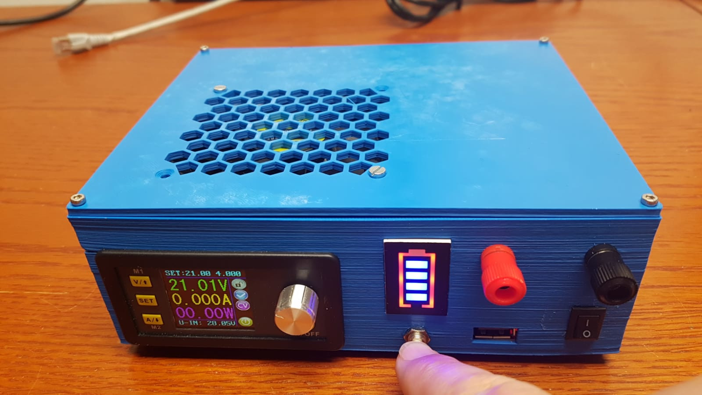
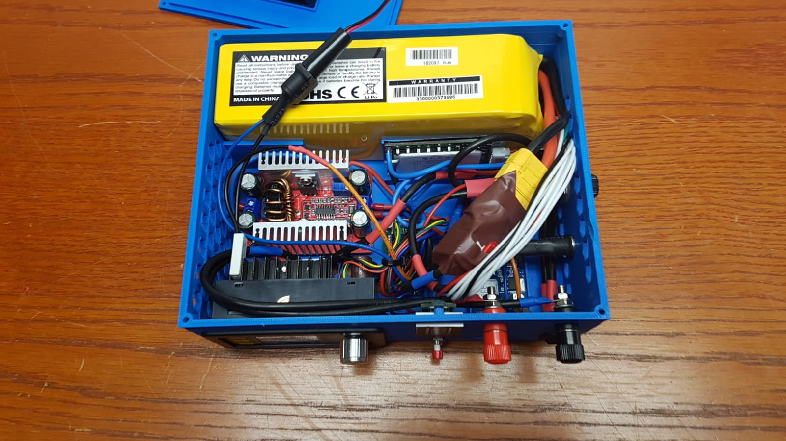
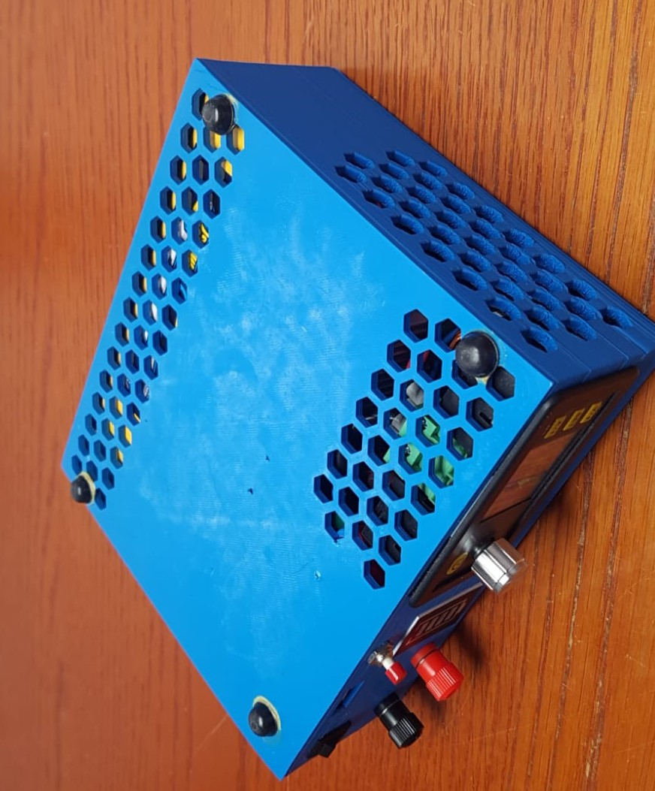
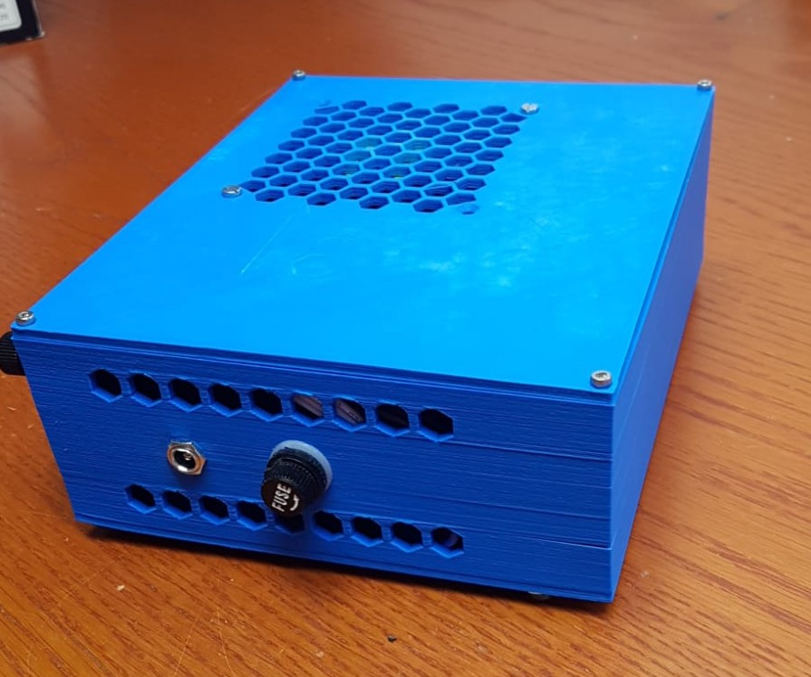
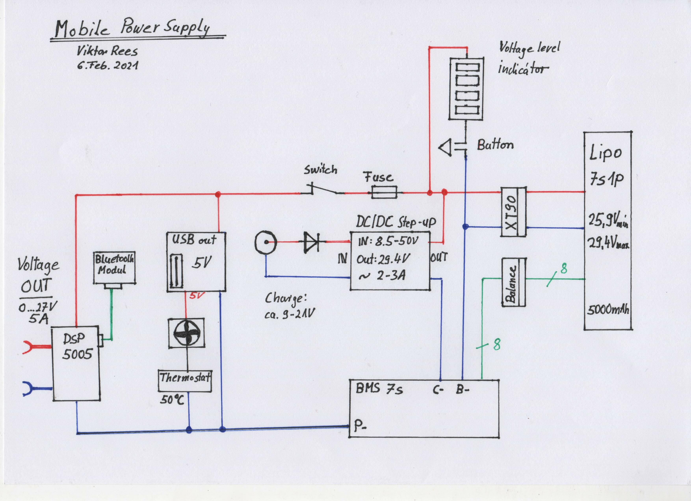
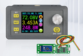
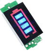
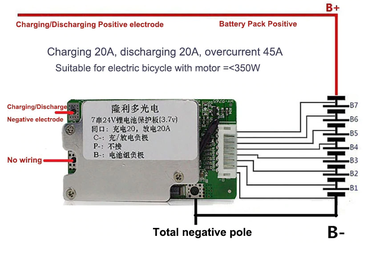
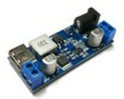
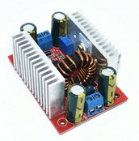

# MobilePowerSupply

This Mobile Power Supply / Power Bank contains a large LiPo battery and can provide Output Power 0 .. 25 V / 5A. Also has an USB charging port delivers 5 V / 3A.

## Schema

## Parts: 

 - [DPS5050](https://de.aliexpress.com/item/4001237790968.html?spm=a2g0o.productlist.0.0.140f6143Yn8PFZ&algo_pvid=ebeb7a26-998e-4409-955f-403dc6c2bfdc&algo_expid=ebeb7a26-998e-4409-955f-403dc6c2bfdc-0&btsid=0b0a01f816125931079466340eec84&ws_ab_test=searchweb0_0,searchweb201602_,searchweb201603_)

 
- [LiPo Battery Voltage Level Indicator](
https://de.aliexpress.com/item/33033899015.html?spm=a2g0s.9042311.0.0.27424c4dz5OryB)

    
 
- [Battery Management System 7S,  24V 20A](https://www.aliexpress.com/snapshot/0.html?spm=a2g0s.9042647.6.2.23384c4d1xL56h&orderId=8002237916849920&productId=33060127967)

    
- [USB 5V Step Down Converter  XY-3606](https://de.aliexpress.com/item/32894669575.html?spm=a2g0s.12269583.0.0.39655eb741bDrY)

    

- [5,5mm x 2,1mm Power Jack](https://de.aliexpress.com/item/32998053822.html?spm=a2g0s.12269583.0.0.23bc6e835vU3Q4)

- [DC 400W 15A Schritt-up Boost Converter](https://de.aliexpress.com/item/32946740719.html?spm=a2g0s.9042311.0.0.1ec64c4duLV4ig)

    

    
